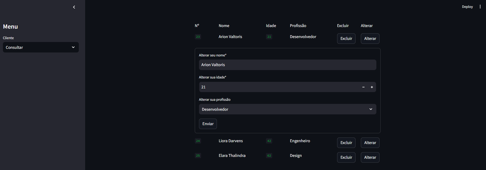

# Cadastro de Usuários

Para este mini-projeto, desenvolvi um CRUD utilizando a biblioteca Streamlit do Python, com o objetivo de aprofundar meu conhecimento sobre essa ferramenta.

## Estrutura do Projeto

O projeto está organizado em vários módulos, cada um responsável por uma parte específica da funcionalidade do aplicativo:

1. **clienteController.py**: Gerencia as operações de banco de dados.
2. **List.py**: Exibe a lista de clientes.
3. **Edit.py**: Permite a edição dos dados de um cliente.
4. **Create.py**: Permite a criação de um novo cliente.
5. **Cliente.py**: Define o modelo de cliente.
6. **main.py**: Arquivo principal que coordena a navegação entre as diferentes páginas.

## Interface

- **Tela Principal**: Esta é a tela inicial onde é possível realizar a inclusão de novos clientes.

---

- **Tela de Consulta**: Permite visualizar todos os usuários cadastrados, além de possibilitar a atualização e exclusão dos mesmos.

---

- **Alteração**: Ao clicar no botão "Alterar" de qualquer usuário, abre-se um formulário preenchido com os dados do usuário selecionado para edição.

